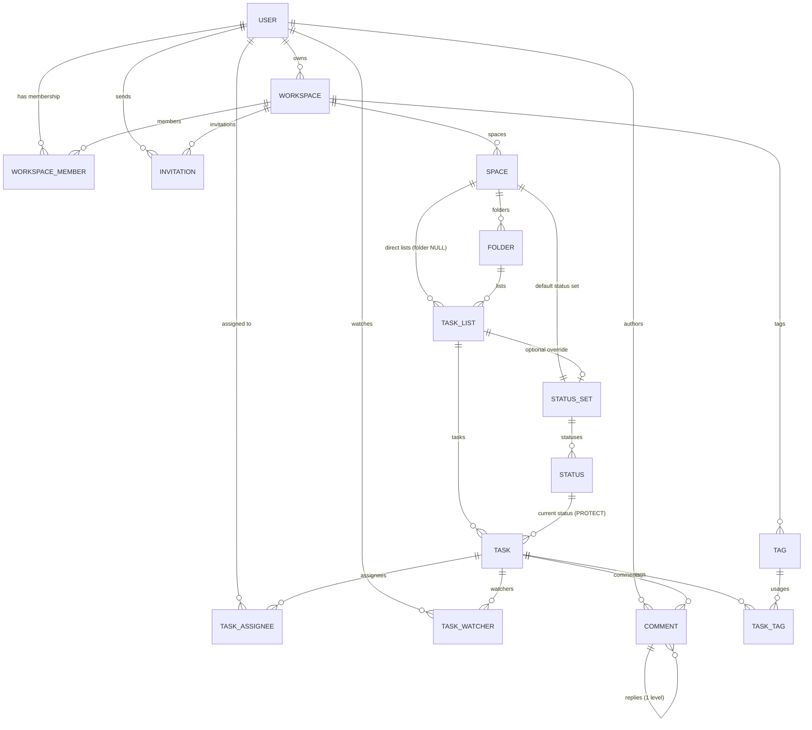

# Data Model — Clickish (ClickUp clone) MVP

| | |
|---|---|
| **Document** | DATA_MODEL.md |
| **Version** | 1.0 |
| **Date** | 2026-08-07 |
| **Owner** | Architecture |
| **Status** | Approved for build — **authoritative** |
| **Applies to** | Django 5.2.17, DRF 3.17.2, Python 3.14, SQLite (dev) / PostgreSQL 16 (prod) |

> **Binding contract.** This document is the single source of truth for the persistence layer.
> Field names here are identical to the JSON field names in `API_CONTRACT.md`.
> If code and this document disagree, the document wins until it is amended by PR.

---

## 0. TL;DR

- **15 models** across **6 apps**: `core` (abstract only), `accounts`, `workspaces`, `spaces`, `tasks`, `comments`. `realtime` has **no models**.
- **Every model uses a UUIDv4 primary key** so clients can generate ids for optimistic creation.
- **Drag & drop ordering uses a lexicographic fractional index** (`position = CharField(max_length=64)`), not integers. See §7.
- **Statuses are per-Space with an optional per-List override** (`StatusSet` owned by exactly one of `space` / `list`). See §5.6.
- **Only `Task` and `Comment` are soft-deleted** (`deleted_at`). Everything else hard-deletes via `CASCADE`.

---

## 1. App layout

```
backend/
  config/                 # settings/, urls.py, asgi.py, wsgi.py, routing.py
  apps/
    core/                 # NEW - abstract base models, mixins, permissions, pagination,
                          #       exception handler, fractional-index helpers. NO concrete models.
    accounts/             # User
    workspaces/           # Workspace, WorkspaceMember, Invitation
    spaces/               # NEW - Space, Folder, TaskList, StatusSet, Status
    tasks/                # Task, TaskAssignee, TaskWatcher, Tag, TaskTag
    comments/             # Comment
    realtime/             # Channels consumers + broadcast helpers. NO models.
```

> **Repo state note.** `accounts`, `workspaces`, `tasks`, `comments`, `realtime` are already scaffolded
> (empty `models.py`). `core` and `spaces` must be created with
> `python manage.py startapp core apps/core` (create the directory first).

`INSTALLED_APPS` order (matters for migrations and for `AUTH_USER_MODEL`):

```python
INSTALLED_APPS = [
    "daphne",
    "django.contrib.admin",
    "django.contrib.auth",
    "django.contrib.contenttypes",
    "django.contrib.sessions",
    "django.contrib.messages",
    "django.contrib.staticfiles",
    "rest_framework",
    "rest_framework_simplejwt",
    "rest_framework_simplejwt.token_blacklist",
    "django_filters",
    "corsheaders",
    "channels",
    "apps.core",
    "apps.accounts",
    "apps.workspaces",
    "apps.spaces",
    "apps.tasks",
    "apps.comments",
    "apps.realtime",
]

AUTH_USER_MODEL = "accounts.User"
DEFAULT_AUTO_FIELD = "django.db.models.BigAutoField"  # irrelevant: all PKs are explicit UUIDs
```

---

## 2. Global conventions

| Convention | Rule |
|---|---|
| Primary key | `id = models.UUIDField(primary_key=True, default=uuid.uuid4, editable=False)` on **every** concrete model. |
| Client-generated ids | `POST` bodies **may** include `id`. If supplied it must be a valid UUIDv4 and unused, else `409 conflict`. |
| Timestamps | `created_at = DateTimeField(auto_now_add=True, db_index=True)`, `updated_at = DateTimeField(auto_now=True)`. Stored in UTC (`USE_TZ = True`). |
| Serialised time | ISO-8601 with `Z`, e.g. `"2026-08-07T09:15:00Z"`. Never a local offset. |
| Colours | `CharField(max_length=7)` holding `#RRGGBB` uppercase, validated by `RegexValidator(r"^#[0-9A-F]{6}$")`. |
| Names | Free text, `CharField`, case-insensitively unique inside their parent (via `UniqueConstraint(Lower("name"), ...)`). |
| Text bodies | Rich text is stored **twice**: `*_html` (`TextField`, sanitised, used for render/search) and `*_json` (`JSONField`, TipTap/ProseMirror doc, used for editing). |
| Soft delete | Only `Task` and `Comment`: `deleted_at = DateTimeField(null=True, blank=True, db_index=True)`. `NULL` = live. Default managers filter it out. |
| Blank vs null | Text fields: `blank=True, default=""`, **never** `null=True`. Nullable relations/dates use `null=True, blank=True`. |
| `on_delete` default | `CASCADE` down the hierarchy; `PROTECT` for `Task.status` and `Workspace.owner`; `SET_NULL` for audit/authorship pointers. |
| Ordering | Models with drag & drop use `position` (fractional index). `Status` uses an integer `order`. |
| Managers | Soft-deleted models expose `objects` (live only) and `all_objects` (everything). |

### 2.1 Abstract bases (`apps/core/models.py`)

```python
import uuid
from django.db import models
from django.utils import timezone


class UUIDModel(models.Model):
    id = models.UUIDField(primary_key=True, default=uuid.uuid4, editable=False)

    class Meta:
        abstract = True


class TimeStampedModel(models.Model):
    created_at = models.DateTimeField(auto_now_add=True, db_index=True)
    updated_at = models.DateTimeField(auto_now=True)

    class Meta:
        abstract = True


class SoftDeleteQuerySet(models.QuerySet):
    def alive(self):
        return self.filter(deleted_at__isnull=True)

    def dead(self):
        return self.filter(deleted_at__isnull=False)

    def delete(self):                      # bulk soft delete
        return self.update(deleted_at=timezone.now())

    def hard_delete(self):
        return super().delete()


class AliveManager(models.Manager.from_queryset(SoftDeleteQuerySet)):
    def get_queryset(self):
        return super().get_queryset().filter(deleted_at__isnull=True)


class SoftDeleteModel(models.Model):
    deleted_at = models.DateTimeField(null=True, blank=True, db_index=True)

    objects = AliveManager()               # default manager -> live rows only
    all_objects = models.Manager.from_queryset(SoftDeleteQuerySet)()

    class Meta:
        abstract = True

    @property
    def is_deleted(self) -> bool:
        return self.deleted_at is not None

    def delete(self, using=None, keep_parents=False):
        self.deleted_at = timezone.now()
        self.save(update_fields=["deleted_at", "updated_at"])

    def hard_delete(self, using=None, keep_parents=False):
        super().delete(using=using, keep_parents=keep_parents)


class PositionedModel(models.Model):
    """Fractional-index ordering. See DATA_MODEL.md section 7."""
    position = models.CharField(max_length=64, db_index=True)

    class Meta:
        abstract = True
```

> **Manager ordering caveat.** Because `objects` is declared first on `SoftDeleteModel`,
> Django uses it as `_default_manager`, which is what related descriptors and the admin use.
> Any code that must see tombstones has to go through `all_objects` explicitly.

### 2.2 Shared choice enums (`apps/core/enums.py`)

```python
from django.db import models


class WorkspaceRole(models.TextChoices):
    OWNER  = "owner",  "Owner"
    ADMIN  = "admin",  "Admin"
    MEMBER = "member", "Member"
    GUEST  = "guest",  "Guest"


class InvitationRole(models.TextChoices):     # owner is NOT invitable
    ADMIN  = "admin",  "Admin"
    MEMBER = "member", "Member"
    GUEST  = "guest",  "Guest"


class InvitationStatus(models.TextChoices):
    PENDING  = "pending",  "Pending"
    ACCEPTED = "accepted", "Accepted"
    REVOKED  = "revoked",  "Revoked"
    EXPIRED  = "expired",  "Expired"


class StatusType(models.TextChoices):
    OPEN   = "open",   "Not started"
    ACTIVE = "active", "Active"
    CLOSED = "closed", "Closed"


class Priority(models.TextChoices):
    URGENT = "urgent", "Urgent"
    HIGH   = "high",   "High"
    NORMAL = "normal", "Normal"
    LOW    = "low",    "Low"
    NONE   = "none",   "No priority"


PRIORITY_ORDER = {          # persisted into Task.priority_order for sane sorting
    Priority.URGENT: 1,
    Priority.HIGH:   2,
    Priority.NORMAL: 3,
    Priority.LOW:    4,
    Priority.NONE:   5,
}


class WatcherSource(models.TextChoices):
    MANUAL        = "manual",        "Manual"
    AUTO_CREATOR  = "auto_creator",  "Auto (creator)"
    AUTO_ASSIGNEE = "auto_assignee", "Auto (assignee)"
    AUTO_COMMENT  = "auto_comment",  "Auto (commented)"
```

---

## 3. ER diagram

### 3.1 Mermaid



### 3.2 ASCII hierarchy

```
User ──< WorkspaceMember >── Workspace
                               │
                               ├──< Invitation
                               ├──< Tag ──────────────┐
                               │                      │
                               └──< Space             │
                                     │  └── StatusSet (1:1, required)
                                     │            └──< Status
                                     ├──< Folder                       (optional level)
                                     │      └──< TaskList              (folder_id NOT NULL)
                                     └──< TaskList                     (folder_id NULL)
                                            │  └── StatusSet (1:1, OPTIONAL override)
                                            │            └──< Status
                                            └──< Task
                                                   ├──< TaskAssignee >── User
                                                   ├──< TaskWatcher  >── User
                                                   ├──< TaskTag      >──┘ (Tag)
                                                   └──< Comment ──< Comment (replies, depth 1)
```

**Path invariant:** `Task.list.space.workspace` is always resolvable, and if
`Task.list.folder` is not null then `Task.list.folder.space_id == Task.list.space_id`.
`TaskList.space_id` is **denormalised and always populated**, even when the list sits inside a folder —
this makes "all lists in a space" and workspace-scoped permission checks a single join instead of two.

---

## 4. `accounts` app

### 4.1 `User`

Custom user, **email is the username**. Replaces `django.contrib.auth.models.User` entirely.

```python
# apps/accounts/models.py
import uuid
from django.contrib.auth.models import AbstractBaseUser, BaseUserManager, PermissionsMixin
from django.core.validators import RegexValidator
from django.db import models
from django.db.models.functions import Lower
from django.utils import timezone

from apps.core.models import TimeStampedModel

HEX_COLOR = RegexValidator(r"^#[0-9A-F]{6}$", "Must be an uppercase #RRGGBB hex colour.")


class UserManager(BaseUserManager):
    use_in_migrations = True

    def _create_user(self, email, password, **extra):
        if not email:
            raise ValueError("Users must have an email address.")
        email = self.normalize_email(email).lower()
        user = self.model(email=email, **extra)
        user.set_password(password)
        user.full_clean(exclude=["password"])
        user.save(using=self._db)
        return user

    def create_user(self, email, password=None, **extra):
        extra.setdefault("is_staff", False)
        extra.setdefault("is_superuser", False)
        return self._create_user(email, password, **extra)

    def create_superuser(self, email, password, **extra):
        extra.setdefault("is_staff", True)
        extra.setdefault("is_superuser", True)
        extra.setdefault("is_active", True)
        if extra["is_staff"] is not True or extra["is_superuser"] is not True:
            raise ValueError("Superuser must have is_staff=True and is_superuser=True.")
        return self._create_user(email, password, **extra)


class User(AbstractBaseUser, PermissionsMixin, TimeStampedModel):
    id = models.UUIDField(primary_key=True, default=uuid.uuid4, editable=False)

    email = models.EmailField(max_length=254, unique=True, db_index=True)
    full_name = models.CharField(max_length=150, blank=True, default="")

    avatar = models.ImageField(
        upload_to="avatars/%Y/%m/", max_length=500, null=True, blank=True
    )
    avatar_color = models.CharField(
        max_length=7, default="#7B68EE", validators=[HEX_COLOR]
    )

    timezone = models.CharField(max_length=64, default="UTC", db_index=False)

    is_active = models.BooleanField(default=True)
    is_staff = models.BooleanField(default=False)
    date_joined = models.DateTimeField(default=timezone.now, editable=False)
    last_seen_at = models.DateTimeField(null=True, blank=True)

    objects = UserManager()

    USERNAME_FIELD = "email"
    EMAIL_FIELD = "email"
    REQUIRED_FIELDS = []          # createsuperuser prompts for email + password only

    class Meta:
        db_table = "users"
        ordering = ["email"]
        verbose_name = "user"
        verbose_name_plural = "users"
        constraints = [
            models.UniqueConstraint(Lower("email"), name="uniq_user_email_ci"),
        ]
        indexes = [
            models.Index(Lower("full_name"), name="idx_user_fullname_ci"),
        ]

    def __str__(self):
        return self.email

    @property
    def initials(self) -> str:
        source = (self.full_name or self.email).strip()
        parts = [p for p in source.replace("@", " ").split() if p]
        if not parts:
            return "?"
        if len(parts) == 1:
            return parts[0][:2].upper()
        return (parts[0][0] + parts[-1][0]).upper()

    @property
    def display_name(self) -> str:
        return self.full_name or self.email.split("@")[0]
```

| Field | Type & constraints | Notes |
|---|---|---|
| `id` | `UUIDField(pk, default=uuid4, editable=False)` | |
| `email` | `EmailField(max_length=254, unique=True, db_index=True)` | Always stored lowercase. Extra CI unique constraint for defence in depth. |
| `password` | inherited `CharField(max_length=128)` | Argon2 first in `PASSWORD_HASHERS`. Never serialised. |
| `full_name` | `CharField(max_length=150, blank=True, default="")` | Single field, not first/last — matches ClickUp. |
| `avatar` | `ImageField(upload_to="avatars/%Y/%m/", max_length=500, null=True, blank=True)` | Max 2 MB, jpeg/png/webp, resized server-side to 256×256. Only user avatars are uploadable — general file attachments are out of scope. |
| `avatar_color` | `CharField(max_length=7, default="#7B68EE")` | Background for the initials fallback. |
| `timezone` | `CharField(max_length=64, default="UTC")` | IANA name, validated against `zoneinfo.available_timezones()` in the serializer (not `choices=` — the tz database changes between releases and would churn migrations). |
| `is_active` | `BooleanField(default=True)` | Deactivation instead of deletion. |
| `is_staff` / `is_superuser` | `BooleanField(default=False)` | Django admin only. **Unrelated** to workspace roles. |
| `date_joined` | `DateTimeField(default=timezone.now, editable=False)` | |
| `last_login` | inherited `DateTimeField(null=True, blank=True)` | Updated on JWT obtain. |
| `last_seen_at` | `DateTimeField(null=True, blank=True)` | Touched by WebSocket presence, throttled to 1 write / 60 s. |
| `created_at`, `updated_at` | from `TimeStampedModel` | |

**Derived (not columns):** `initials`, `display_name`.

---

## 5. `workspaces` and `spaces` apps

### 5.1 `Workspace` (`workspaces`)

```python
class Workspace(UUIDModel, TimeStampedModel):
    name = models.CharField(max_length=120)
    slug = models.SlugField(max_length=140, unique=True, db_index=True, allow_unicode=False)
    description = models.TextField(blank=True, default="")
    color = models.CharField(max_length=7, default="#7B68EE", validators=[HEX_COLOR])
    avatar = models.ImageField(upload_to="workspaces/%Y/%m/", max_length=500,
                               null=True, blank=True)

    owner = models.ForeignKey("accounts.User", on_delete=models.PROTECT,
                              related_name="owned_workspaces")
    created_by = models.ForeignKey("accounts.User", on_delete=models.SET_NULL,
                                   null=True, blank=True, related_name="created_workspaces")

    member_count = models.PositiveIntegerField(default=0)   # denormalised

    class Meta:
        db_table = "workspaces"
        ordering = ["name"]
        indexes = [models.Index(fields=["owner"], name="idx_ws_owner")]
```

| Field | Type & constraints | Notes |
|---|---|---|
| `name` | `CharField(max_length=120)` | Not globally unique. |
| `slug` | `SlugField(max_length=140, unique=True, db_index=True)` | Auto-derived from `name` + 6-char suffix on collision. Immutable after create in MVP. |
| `description` | `TextField(blank=True, default="")` | |
| `color` | `CharField(max_length=7, default="#7B68EE")` | Sidebar chip colour. |
| `avatar` | `ImageField(null=True, blank=True)` | Optional. |
| `owner` | `FK(User, on_delete=PROTECT, related_name="owned_workspaces")` | `PROTECT` so a user with workspaces cannot be hard-deleted; deactivate + transfer ownership instead. |
| `created_by` | `FK(User, on_delete=SET_NULL, null=True, related_name="created_workspaces")` | |
| `member_count` | `PositiveIntegerField(default=0)` | Denormalised; maintained by signal on `WorkspaceMember` create/delete. |

**Invariants**
- There is always exactly one `WorkspaceMember` with `role="owner"` whose `user_id == workspace.owner_id`.
- Deleting a workspace cascades to spaces → folders/lists → tasks → comments. This is a **hard delete** and is `owner`-only, gated behind a name-confirmation body field.

### 5.2 `WorkspaceMember` (`workspaces`)

```python
class WorkspaceMember(UUIDModel, TimeStampedModel):
    workspace = models.ForeignKey(Workspace, on_delete=models.CASCADE,
                                  related_name="members")
    user = models.ForeignKey("accounts.User", on_delete=models.CASCADE,
                             related_name="workspace_memberships")
    role = models.CharField(max_length=10, choices=WorkspaceRole.choices,
                            default=WorkspaceRole.MEMBER, db_index=True)
    invited_by = models.ForeignKey("accounts.User", on_delete=models.SET_NULL,
                                   null=True, blank=True, related_name="invited_members")
    joined_at = models.DateTimeField(auto_now_add=True)
    last_active_at = models.DateTimeField(null=True, blank=True)

    class Meta:
        db_table = "workspace_members"
        ordering = ["role", "user__email"]
        constraints = [
            models.UniqueConstraint(fields=["workspace", "user"],
                                    name="uniq_member_per_workspace"),
        ]
        indexes = [
            models.Index(fields=["workspace", "role"], name="idx_member_ws_role"),
            models.Index(fields=["user", "workspace"], name="idx_member_user_ws"),
        ]
```

| Field | Type & constraints | Notes |
|---|---|---|
| `workspace` | `FK(Workspace, CASCADE, related_name="members")` | |
| `user` | `FK(User, CASCADE, related_name="workspace_memberships")` | |
| `role` | `CharField(max_length=10, choices=WorkspaceRole, default="member", db_index=True)` | `owner`\|`admin`\|`member`\|`guest`. |
| `invited_by` | `FK(User, SET_NULL, null=True, related_name="invited_members")` | |
| `joined_at` | `DateTimeField(auto_now_add=True)` | |
| `last_active_at` | `DateTimeField(null=True, blank=True)` | For the members table "last active" column. |

**Invariants (service layer, not DB):**
- At least one `owner` per workspace at all times. Removing/demoting the last owner → `409 conflict` (`code: "conflict"`).
- Role can only be changed by `owner`; `admin` may change `member`↔`guest` only.
- `ordering = ["role", "user__email"]` sorts alphabetically by the stored value: `admin`, `guest`, `member`, `owner`. The API re-sorts by rank (`owner, admin, member, guest`) using an annotated `Case/When`; do not rely on `Meta.ordering` for presentation.

### 5.3 `Invitation` (`workspaces`)

```python
class Invitation(UUIDModel, TimeStampedModel):
    workspace = models.ForeignKey(Workspace, on_delete=models.CASCADE,
                                  related_name="invitations")
    email = models.EmailField(max_length=254, db_index=True)
    role = models.CharField(max_length=10, choices=InvitationRole.choices,
                            default=InvitationRole.MEMBER)
    token = models.CharField(max_length=64, unique=True, db_index=True, editable=False)
    status = models.CharField(max_length=10, choices=InvitationStatus.choices,
                              default=InvitationStatus.PENDING, db_index=True)

    invited_by = models.ForeignKey("accounts.User", on_delete=models.SET_NULL,
                                   null=True, blank=True,
                                   related_name="sent_invitations")
    accepted_by = models.ForeignKey("accounts.User", on_delete=models.SET_NULL,
                                    null=True, blank=True,
                                    related_name="accepted_invitations")

    expires_at = models.DateTimeField(db_index=True)
    accepted_at = models.DateTimeField(null=True, blank=True)
    revoked_at = models.DateTimeField(null=True, blank=True)
    sent_count = models.PositiveSmallIntegerField(default=1)
    last_sent_at = models.DateTimeField(null=True, blank=True)

    class Meta:
        db_table = "invitations"
        ordering = ["-created_at"]
        constraints = [
            models.UniqueConstraint(
                "workspace", Lower("email"),
                condition=models.Q(status="pending"),
                name="uniq_pending_invite_per_email_per_ws",
            ),
        ]
        indexes = [
            models.Index(fields=["workspace", "status"], name="idx_invite_ws_status"),
            models.Index(Lower("email"), name="idx_invite_email_ci"),
        ]
```

| Field | Type & constraints | Notes |
|---|---|---|
| `email` | `EmailField(max_length=254, db_index=True)` | Lowercased on save. May or may not match an existing `User`. |
| `role` | `CharField(max_length=10, choices=InvitationRole)` | `owner` is deliberately **not** invitable. |
| `token` | `CharField(max_length=64, unique=True, editable=False)` | `secrets.token_urlsafe(32)` → 43 chars. **Stored in plaintext for MVP** — see §11 review items. |
| `status` | `CharField(choices=InvitationStatus, default="pending", db_index=True)` | `pending`→`accepted`\|`revoked`\|`expired`. Terminal states are immutable. |
| `expires_at` | `DateTimeField(db_index=True)` | `created_at + 7 days` (`settings.INVITATION_TTL_DAYS`). A daily management command flips overdue `pending` rows to `expired`; reads also treat `expires_at < now` as expired. |
| `sent_count` / `last_sent_at` | resend bookkeeping | Resend throttled to 1 per 5 minutes, max `sent_count = 5`. |

**Partial unique constraint rationale:** you can invite the same email again *after* the previous
invite was revoked/expired/accepted, but you cannot have two live pending invites for the same
address in the same workspace (that is a `409 conflict`).

> **SQLite note.** Partial unique constraints and expression indexes (`Lower(...)`) are supported by
> SQLite 3.9+/Django 5.2, so the dev database behaves the same as PostgreSQL. Verify with
> `python manage.py check --database default` after migrating.

### 5.4 `Space` (`spaces`)

```python
class Space(UUIDModel, TimeStampedModel, PositionedModel):
    workspace = models.ForeignKey("workspaces.Workspace", on_delete=models.CASCADE,
                                  related_name="spaces")
    name = models.CharField(max_length=120)
    description = models.TextField(blank=True, default="")
    color = models.CharField(max_length=7, default="#7B68EE", validators=[HEX_COLOR])
    icon = models.CharField(max_length=40, blank=True, default="")   # lucide icon name
    is_private = models.BooleanField(default=False)
    archived = models.BooleanField(default=False, db_index=True)
    created_by = models.ForeignKey("accounts.User", on_delete=models.SET_NULL,
                                   null=True, blank=True, related_name="created_spaces")

    class Meta:
        db_table = "spaces"
        ordering = ["position", "name"]
        constraints = [
            models.UniqueConstraint("workspace", Lower("name"),
                                    name="uniq_space_name_per_workspace"),
            models.UniqueConstraint(fields=["workspace", "position"],
                                    name="uniq_space_position_per_workspace"),
        ]
        indexes = [
            models.Index(fields=["workspace", "archived", "position"],
                         name="idx_space_ws_arch_pos"),
        ]
```

| Field | Type & constraints | Notes |
|---|---|---|
| `workspace` | `FK(Workspace, CASCADE, related_name="spaces")` | |
| `name` | `CharField(max_length=120)`, CI-unique per workspace | |
| `icon` | `CharField(max_length=40, blank=True, default="")` | A `lucide-react` icon name, e.g. `"rocket"`. Empty = coloured initial. |
| `is_private` | `BooleanField(default=False)` | MVP semantics: a private space is hidden from `guest` members only. Full per-space ACLs are post-MVP. |
| `archived` | `BooleanField(default=False, db_index=True)` | Hidden from the sidebar by default; data retained. |
| `position` | `CharField(max_length=64, db_index=True)` | Scope: `workspace_id`. |

**Cascade:** deleting a `Space` deletes its `StatusSet`, `Folder`s, `TaskList`s, `Task`s and `Comment`s. Guarded by a confirmation body field in the API.

### 5.5 `Folder` (`spaces`)

```python
class Folder(UUIDModel, TimeStampedModel, PositionedModel):
    space = models.ForeignKey(Space, on_delete=models.CASCADE, related_name="folders")
    name = models.CharField(max_length=120)
    color = models.CharField(max_length=7, default="#7B68EE", validators=[HEX_COLOR])
    archived = models.BooleanField(default=False, db_index=True)
    created_by = models.ForeignKey("accounts.User", on_delete=models.SET_NULL,
                                   null=True, blank=True, related_name="created_folders")

    class Meta:
        db_table = "folders"
        ordering = ["position", "name"]
        constraints = [
            models.UniqueConstraint("space", Lower("name"),
                                    name="uniq_folder_name_per_space"),
            models.UniqueConstraint(fields=["space", "position"],
                                    name="uniq_folder_position_per_space"),
        ]
        indexes = [
            models.Index(fields=["space", "archived", "position"],
                         name="idx_folder_space_arch_pos"),
        ]
```

`Folder` is a **pure grouping node**: it has no statuses and no tasks of its own. It exists only to
group `TaskList`s. `position` scope: `space_id`.

**Deleting a folder** requires an explicit choice, sent as a query param on `DELETE`:
- `?strategy=cascade` — delete the folder and all its lists/tasks (default, `admin`+ only);
- `?strategy=detach` — move the folder's lists up to the space (`folder_id = NULL`), then delete the folder.

### 5.6 `TaskList` (`spaces`) — the "List"

> **Naming decision.** The Python class is `TaskList` because `List` shadows `typing.List` and reads
> badly in queryset code. The database table is `lists`, `verbose_name` is `"list"`, and **every API
> path and JSON field uses `list`** (`/api/v1/lists/{id}/`, `list_id`). Do not leak `task_list` into JSON.

```python
class TaskList(UUIDModel, TimeStampedModel, PositionedModel):
    space = models.ForeignKey(Space, on_delete=models.CASCADE, related_name="lists")
    folder = models.ForeignKey(Folder, on_delete=models.CASCADE, null=True, blank=True,
                               related_name="lists")
    name = models.CharField(max_length=120)
    description = models.TextField(blank=True, default="")
    color = models.CharField(max_length=7, default="#7B68EE", validators=[HEX_COLOR])
    archived = models.BooleanField(default=False, db_index=True)

    default_view = models.CharField(max_length=8, default="list",
                                    choices=[("list", "List"), ("board", "Board")])
    task_count = models.PositiveIntegerField(default=0)          # denormalised, live tasks
    open_task_count = models.PositiveIntegerField(default=0)     # denormalised, status.type != closed

    created_by = models.ForeignKey("accounts.User", on_delete=models.SET_NULL,
                                   null=True, blank=True, related_name="created_lists")

    class Meta:
        db_table = "lists"
        verbose_name = "list"
        verbose_name_plural = "lists"
        ordering = ["position", "name"]
        constraints = [
            # folder-scoped name uniqueness
            models.UniqueConstraint(
                "folder", Lower("name"),
                condition=models.Q(folder__isnull=False),
                name="uniq_list_name_per_folder",
            ),
            # space-level (folderless) name uniqueness
            models.UniqueConstraint(
                "space", Lower("name"),
                condition=models.Q(folder__isnull=True),
                name="uniq_list_name_per_space_root",
            ),
            models.UniqueConstraint(
                fields=["folder", "position"], condition=models.Q(folder__isnull=False),
                name="uniq_list_position_per_folder",
            ),
            models.UniqueConstraint(
                fields=["space", "position"], condition=models.Q(folder__isnull=True),
                name="uniq_list_position_per_space_root",
            ),
        ]
        indexes = [
            models.Index(fields=["space", "folder", "position"], name="idx_list_space_folder_pos"),
            models.Index(fields=["space", "archived"], name="idx_list_space_arch"),
        ]
```

| Field | Type & constraints | Notes |
|---|---|---|
| `space` | `FK(Space, CASCADE, related_name="lists")` | **Always set**, even for lists inside a folder (denormalised parent pointer). |
| `folder` | `FK(Folder, CASCADE, null=True, blank=True, related_name="lists")` | `NULL` ⇒ the list sits directly under the space. This is the "Folder is optional" requirement. |
| `default_view` | `CharField(max_length=8, choices=[("list",…),("board",…)], default="list")` | The view a user lands on. Per-**user** view preference is client-side (Zustand + `localStorage`), not persisted server-side in MVP. |
| `task_count` | `PositiveIntegerField(default=0)` | Live (non-deleted, non-archived) tasks. Maintained by signals. |
| `open_task_count` | `PositiveIntegerField(default=0)` | Tasks whose `status.type != "closed"`. Drives the sidebar badge. |
| `position` | `CharField(max_length=64, db_index=True)` | Scope: `(space_id, folder_id)` — a list moving out of a folder gets a **new** position in the space-root scope. |

**Two-parent invariant** (enforced in `TaskList.clean()` and in the serializer):

```python
def clean(self):
    if self.folder_id and self.folder.space_id != self.space_id:
        raise ValidationError({"folder_id": "Folder must belong to the same space as the list."})
```

**Why not a single nullable `parent` generic FK?** Two explicit FKs keep every query
(`WHERE space_id = ?`) index-friendly and make the permission check a single join. A polymorphic
parent would need `GenericForeignKey`, which cannot be joined or constrained.

### 5.7 `StatusSet` (`spaces`)

A named, ordered collection of `Status` rows. Owned by **exactly one** of a `Space` (the space
default, always present) or a `TaskList` (an override).

```python
class StatusSet(UUIDModel, TimeStampedModel):
    name = models.CharField(max_length=80, default="Default")

    space = models.OneToOneField(Space, on_delete=models.CASCADE, null=True, blank=True,
                                 related_name="status_set")
    list = models.OneToOneField(TaskList, on_delete=models.CASCADE, null=True, blank=True,
                                related_name="status_set")

    class Meta:
        db_table = "status_sets"
        ordering = ["created_at"]
        constraints = [
            models.CheckConstraint(
                condition=models.Q(space__isnull=False, list__isnull=True)
                        | models.Q(space__isnull=True, list__isnull=False),
                name="statusset_exactly_one_owner",
            ),
        ]
```

> Django 5.1+ renamed `CheckConstraint(check=...)` to `condition=...`. On Django 5.2 use `condition`.

| Field | Type & constraints | Notes |
|---|---|---|
| `name` | `CharField(max_length=80, default="Default")` | e.g. `"Default"`, `"Bug workflow"`. |
| `space` | `OneToOneField(Space, CASCADE, null=True, blank=True, related_name="status_set")` | Non-null ⇒ this is a space default. |
| `list` | `OneToOneField(TaskList, CASCADE, null=True, blank=True, related_name="status_set")` | Non-null ⇒ this is a per-list override. |

**Resolution rule (the core of ClickUp's status model):**

```python
def effective_status_set(task_list: TaskList) -> StatusSet:
    """The status set a list's tasks must use."""
    return getattr(task_list, "status_set", None) or task_list.space.status_set
```

- Every `Space` gets a `StatusSet` **automatically on creation** (`post_save` signal / service),
  seeded with `TO DO (open, #87909E, default)`, `IN PROGRESS (active, #4194F6)`, `COMPLETE (closed, #6BC950)`.
- A `TaskList` has **no** `StatusSet` by default and inherits the space's.
- `PUT /api/v1/lists/{id}/status-set/` creates the override; `DELETE` removes it and reverts to inheritance.
- Both operations require a `status_mapping` for existing tasks (see §5.8 migration rule).

### 5.8 `Status` (`spaces`)

```python
class Status(UUIDModel, TimeStampedModel):
    status_set = models.ForeignKey(StatusSet, on_delete=models.CASCADE,
                                   related_name="statuses")
    name = models.CharField(max_length=60)
    color = models.CharField(max_length=7, default="#87909E", validators=[HEX_COLOR])
    type = models.CharField(max_length=8, choices=StatusType.choices,
                            default=StatusType.OPEN, db_index=True)
    order = models.PositiveSmallIntegerField(default=0, db_index=True)
    is_default = models.BooleanField(default=False)

    class Meta:
        db_table = "statuses"
        ordering = ["order", "name"]
        constraints = [
            models.UniqueConstraint("status_set", Lower("name"),
                                    name="uniq_status_name_per_set"),
            models.UniqueConstraint(fields=["status_set", "order"],
                                    name="uniq_status_order_per_set",
                                    deferrable=models.Deferrable.DEFERRED),
            models.UniqueConstraint(fields=["status_set"],
                                    condition=models.Q(is_default=True),
                                    name="uniq_default_status_per_set"),
        ]
        indexes = [
            models.Index(fields=["status_set", "order"], name="idx_status_set_order"),
        ]
```

| Field | Type & constraints | Notes |
|---|---|---|
| `status_set` | `FK(StatusSet, CASCADE, related_name="statuses")` | |
| `name` | `CharField(max_length=60)`, CI-unique per set | Displayed uppercase in the UI by CSS, stored as typed. |
| `color` | `CharField(max_length=7, default="#87909E")` | |
| `type` | `CharField(max_length=8, choices=StatusType, default="open", db_index=True)` | `open` \| `active` \| `closed`. Drives board grouping colour, "completed" semantics and the `status_type` filter. |
| `order` | `PositiveSmallIntegerField(default=0, db_index=True)` | 0-based, contiguous within a set. **Integer, not fractional** — status reordering is a whole-set `PUT`, so the whole array is rewritten atomically; there is no insert-between concurrency problem. |
| `is_default` | `BooleanField(default=False)` | Exactly one per set. Used for new tasks when `status_id` is omitted. |

**Set-level invariants (validated in the `PUT` serializer, `400 validation_error` on failure):**
1. `1 <= len(statuses) <= 30`.
2. Exactly one status has `is_default = True`, and it must have `type != "closed"`.
3. At least one status has `type = "closed"`.
4. `order` values are `0..n-1` with no gaps and no duplicates (the API assigns them from array index; a client-supplied `order` is ignored).
5. Names are unique case-insensitively within the set.

> **Why `deferrable=DEFERRED` on `(status_set, order)`:** rewriting an ordered array inevitably passes
> through transient duplicate `order` values mid-`UPDATE`. Deferring the check to `COMMIT` avoids a
> two-phase "shift everything to negative numbers first" dance.
> **SQLite caveat:** SQLite ignores deferrability. In dev, the service layer therefore performs the
> rewrite in the safe order (`order = -1 - index` pass, then `order = index` pass) inside one
> transaction, which is correct on both backends. Do not skip the two-pass write.

**Deleting a status** (only via `PUT` on the set, by omitting it) requires
`status_mapping: {"<removed_status_id>": "<target_status_id>"}` covering every removed status that
still has tasks. Because `Task.status` is `PROTECT`, a missing mapping surfaces as
`409 conflict` with `error.details.status_mapping`.

---

## 6. `tasks` app

### 6.1 `Task`

```python
class Task(UUIDModel, TimeStampedModel, SoftDeleteModel, PositionedModel):
    list = models.ForeignKey("spaces.TaskList", on_delete=models.CASCADE,
                             related_name="tasks")
    status = models.ForeignKey("spaces.Status", on_delete=models.PROTECT,
                               related_name="tasks")

    title = models.CharField(max_length=500)
    description_html = models.TextField(blank=True, default="")
    description_json = models.JSONField(null=True, blank=True, default=None)

    priority = models.CharField(max_length=7, choices=Priority.choices,
                                default=Priority.NONE, db_index=True)
    priority_order = models.PositiveSmallIntegerField(default=5, db_index=True,
                                                      editable=False)

    due_date = models.DateTimeField(null=True, blank=True, db_index=True)
    start_date = models.DateTimeField(null=True, blank=True)
    time_estimate_minutes = models.PositiveIntegerField(
        null=True, blank=True,
        validators=[MinValueValidator(1), MaxValueValidator(60 * 24 * 365)],
    )

    archived = models.BooleanField(default=False, db_index=True)
    completed_at = models.DateTimeField(null=True, blank=True)
    comment_count = models.PositiveIntegerField(default=0)

    assignees = models.ManyToManyField("accounts.User", through="TaskAssignee",
                                       related_name="assigned_tasks", blank=True)
    watchers = models.ManyToManyField("accounts.User", through="TaskWatcher",
                                      related_name="watched_tasks", blank=True)
    tags = models.ManyToManyField("Tag", through="TaskTag",
                                  related_name="tasks", blank=True)

    created_by = models.ForeignKey("accounts.User", on_delete=models.SET_NULL,
                                   null=True, blank=True, related_name="created_tasks")
    updated_by = models.ForeignKey("accounts.User", on_delete=models.SET_NULL,
                                   null=True, blank=True, related_name="updated_tasks")

    class Meta:
        db_table = "tasks"
        ordering = ["position", "created_at"]
        constraints = [
            models.UniqueConstraint(
                fields=["list", "status", "position"],
                condition=models.Q(deleted_at__isnull=True),
                name="uniq_task_position_per_column",
            ),
            models.CheckConstraint(
                condition=models.Q(start_date__isnull=True)
                        | models.Q(due_date__isnull=True)
                        | models.Q(start_date__lte=models.F("due_date")),
                name="task_start_before_due",
            ),
        ]
        indexes = [
            models.Index(fields=["list", "status", "position"], name="idx_task_column_pos"),
            models.Index(fields=["list", "deleted_at", "archived"], name="idx_task_list_live"),
            models.Index(fields=["list", "updated_at"], name="idx_task_list_updated"),
            models.Index(fields=["due_date"], name="idx_task_due"),
            models.Index(fields=["priority_order"], name="idx_task_priority_order"),
            models.Index(fields=["created_by"], name="idx_task_creator"),
        ]

    def save(self, *args, **kwargs):
        self.priority_order = PRIORITY_ORDER[self.priority]
        super().save(*args, **kwargs)
```

| Field | Type & constraints | API name | Notes |
|---|---|---|---|
| `id` | `UUIDField(pk)` | `id` | |
| `list` | `FK(TaskList, CASCADE, related_name="tasks")` | `list_id` | Moving lists is allowed via `PATCH /tasks/{id}/move/` with a `list_id`. |
| `status` | `FK(Status, PROTECT, related_name="tasks")` | `status_id` | `PROTECT` guarantees a status with tasks cannot vanish silently. Must belong to the list's **effective** status set. |
| `title` | `CharField(max_length=500)` | `title` | Required, `strip()`-ed, must be non-empty after strip. |
| `description_html` | `TextField(blank=True, default="")` | `description_html` | Sanitised server-side with `nh3` (allow-list: `p, br, strong, em, u, s, code, pre, a[href rel target], ul, ol, li, h1-h3, blockquote, hr`). |
| `description_json` | `JSONField(null=True, blank=True, default=None)` | `description_json` | TipTap/ProseMirror document. Max 256 KB serialised. Source of truth for editing; `description_html` is the render/search projection. |
| `priority` | `CharField(max_length=7, choices=Priority, default="none", db_index=True)` | `priority` | `urgent`\|`high`\|`normal`\|`low`\|`none`. |
| `priority_order` | `PositiveSmallIntegerField(default=5, db_index=True, editable=False)` | *(not serialised)* | Derived in `save()`. Exists solely so `?ordering=priority_order` sorts urgent→none instead of alphabetically. |
| `position` | `CharField(max_length=64, db_index=True)` | `position` | Fractional index. Scope: `(list_id, status_id)`. See §7. |
| `due_date` | `DateTimeField(null=True, blank=True, db_index=True)` | `due_date` | UTC instant. A "date only" due date is stored as `T23:59:59Z` **in the user's timezone converted to UTC**; the client sends the resolved instant. |
| `start_date` | `DateTimeField(null=True, blank=True)` | `start_date` | Must be `<= due_date` (DB check constraint). |
| `time_estimate_minutes` | `PositiveIntegerField(null=True, blank=True, 1..525600)` | `time_estimate_minutes` | Estimate only. Time **tracking** is out of scope. |
| `archived` | `BooleanField(default=False, db_index=True)` | `archived` | Hidden from default queries (`?archived=false` default). |
| `completed_at` | `DateTimeField(null=True, blank=True)` | `completed_at` | **Derived**: set to `now()` when the task transitions into a `closed`-type status; cleared to `NULL` when it leaves one. Never client-settable. |
| `comment_count` | `PositiveIntegerField(default=0)` | `comment_count` | **Denormalised**: live (non-deleted) comments incl. replies. |
| `deleted_at` | `DateTimeField(null=True, blank=True, db_index=True)` | *(not serialised; `is_deleted` is)* | Soft delete. Purged by a cron after 30 days. |
| `created_by` / `updated_by` | `FK(User, SET_NULL, null=True)` | `created_by`, `updated_by` (embedded user objects) | `updated_by` set on **every** mutating write, including `move`. |
| `assignees` | `M2M(User, through=TaskAssignee, related_name="assigned_tasks")` | `assignees` (embedded) / `assignee_ids` (write) | |
| `watchers` | `M2M(User, through=TaskWatcher, related_name="watched_tasks")` | `watchers` / `watcher_ids` | |
| `tags` | `M2M(Tag, through=TaskTag, related_name="tasks")` | `tags` (embedded) / `tag_ids` (write) | |

**Cross-field validation (`Task.clean()` + serializer):**

```python
def clean(self):
    effective = effective_status_set(self.list)
    if self.status.status_set_id != effective.id:
        raise ValidationError({"status_id": "Status does not belong to this list's status set."})
    if self.start_date and self.due_date and self.start_date > self.due_date:
        raise ValidationError({"start_date": "start_date must be on or before due_date."})
```

The `status_id` failure is surfaced by the API as `400` with `error.code = "invalid_status_for_list"`.

**Auto-watch rules (service layer):** a `TaskWatcher` row is created with the matching `source` when
a user (a) creates the task, (b) is added as an assignee, or (c) posts a comment — unless a row for
that `(task, user)` already exists. Users may remove themselves via `DELETE /tasks/{id}/watch/`;
removal is remembered (the row is deleted and not re-added by `auto_comment`, but **is** re-added by
a fresh `auto_assignee` event).

**Full-text search.** The base model has **no** search column, so SQLite and PostgreSQL share one
migration history.
- **SQLite (dev):** `Q(title__icontains=q) | Q(description_html__icontains=q)`.
- **PostgreSQL (prod):** an additional, `connection.vendor`-guarded migration adds
  `search_vector tsvector`, a `GinIndex`, and a trigger keeping it in sync with
  `setweight(to_tsvector('english', title), 'A') || setweight(to_tsvector('english', description_html), 'B')`.
  The search view branches on `connection.vendor`. Both paths must satisfy the same API contract.

### 6.2 `TaskAssignee` (through model)

```python
class TaskAssignee(UUIDModel):
    task = models.ForeignKey(Task, on_delete=models.CASCADE, related_name="task_assignees")
    user = models.ForeignKey("accounts.User", on_delete=models.CASCADE,
                             related_name="task_assignments")
    assigned_by = models.ForeignKey("accounts.User", on_delete=models.SET_NULL,
                                    null=True, blank=True, related_name="+")
    assigned_at = models.DateTimeField(auto_now_add=True)

    class Meta:
        db_table = "task_assignees"
        ordering = ["assigned_at"]
        constraints = [
            models.UniqueConstraint(fields=["task", "user"], name="uniq_task_assignee"),
        ]
        indexes = [
            models.Index(fields=["user", "task"], name="idx_assignee_user_task"),
        ]
```

**Why a through model is required:** we need `assigned_at` (ordering of avatar stack, "assigned to you"
notifications later) and `assigned_by` (audit). A plain `M2M` would give neither.
`idx_assignee_user_task` is what makes the `?assignee=me` filter fast at workspace scale.

**Rule:** a user can only be assigned if they are an active `WorkspaceMember` of the task's workspace.
Otherwise `400 validation_error` on `assignee_ids`. When a member is removed from a workspace, all
their `TaskAssignee` and `TaskWatcher` rows in that workspace are deleted.

### 6.3 `TaskWatcher`

```python
class TaskWatcher(UUIDModel):
    task = models.ForeignKey(Task, on_delete=models.CASCADE, related_name="task_watchers")
    user = models.ForeignKey("accounts.User", on_delete=models.CASCADE,
                             related_name="task_watches")
    source = models.CharField(max_length=14, choices=WatcherSource.choices,
                              default=WatcherSource.MANUAL)
    created_at = models.DateTimeField(auto_now_add=True)

    class Meta:
        db_table = "task_watchers"
        ordering = ["created_at"]
        constraints = [
            models.UniqueConstraint(fields=["task", "user"], name="uniq_task_watcher"),
        ]
        indexes = [models.Index(fields=["user"], name="idx_watcher_user")]
```

### 6.4 `Tag`

```python
class Tag(UUIDModel, TimeStampedModel):
    workspace = models.ForeignKey("workspaces.Workspace", on_delete=models.CASCADE,
                                  related_name="tags")
    name = models.CharField(max_length=60)
    color = models.CharField(max_length=7, default="#7B68EE", validators=[HEX_COLOR])
    usage_count = models.PositiveIntegerField(default=0)
    created_by = models.ForeignKey("accounts.User", on_delete=models.SET_NULL,
                                   null=True, blank=True, related_name="created_tags")

    class Meta:
        db_table = "tags"
        ordering = ["name"]
        constraints = [
            models.UniqueConstraint("workspace", Lower("name"),
                                    name="uniq_tag_name_per_workspace"),
        ]
        indexes = [models.Index(Lower("name"), name="idx_tag_name_ci")]
```

Tags are **workspace-scoped** (as in ClickUp, where tags are shared across a Space/Workspace), not
list-scoped, so the same tag can label tasks in different spaces. `usage_count` is denormalised from
`TaskTag` and drives the tag picker's "most used" ordering.

### 6.5 `TaskTag` (through model)

```python
class TaskTag(UUIDModel):
    task = models.ForeignKey(Task, on_delete=models.CASCADE, related_name="task_tags")
    tag = models.ForeignKey(Tag, on_delete=models.CASCADE, related_name="task_tags")
    created_at = models.DateTimeField(auto_now_add=True)

    class Meta:
        db_table = "task_tags"
        ordering = ["created_at"]
        constraints = [
            models.UniqueConstraint(fields=["task", "tag"], name="uniq_task_tag"),
        ]
        indexes = [models.Index(fields=["tag", "task"], name="idx_tasktag_tag_task")]
```

**Rule:** `tag.workspace_id` must equal `task.list.space.workspace_id`, else `400 validation_error`.

---

## 7. `comments` app

### 7.1 `Comment`

```python
class Comment(UUIDModel, TimeStampedModel, SoftDeleteModel):
    task = models.ForeignKey("tasks.Task", on_delete=models.CASCADE,
                             related_name="comments")
    parent = models.ForeignKey("self", on_delete=models.CASCADE, null=True, blank=True,
                               related_name="replies")
    author = models.ForeignKey("accounts.User", on_delete=models.SET_NULL,
                               null=True, blank=True, related_name="comments")

    body_html = models.TextField()
    body_json = models.JSONField(null=True, blank=True, default=None)

    is_edited = models.BooleanField(default=False)
    edited_at = models.DateTimeField(null=True, blank=True)
    reply_count = models.PositiveIntegerField(default=0)

    class Meta:
        db_table = "comments"
        ordering = ["created_at"]
        indexes = [
            models.Index(fields=["task", "deleted_at", "created_at"],
                         name="idx_comment_task_live"),
            models.Index(fields=["parent", "created_at"], name="idx_comment_parent"),
            models.Index(fields=["author"], name="idx_comment_author"),
        ]

    def clean(self):
        if self.parent_id:
            if self.parent.parent_id is not None:
                raise ValidationError(
                    {"parent_id": "Comments can only be nested one level deep."})
            if self.parent.task_id != self.task_id:
                raise ValidationError(
                    {"parent_id": "Parent comment belongs to a different task."})
```

| Field | Type & constraints | Notes |
|---|---|---|
| `task` | `FK(Task, CASCADE, related_name="comments")` | |
| `parent` | `FK("self", CASCADE, null=True, blank=True, related_name="replies")` | `NULL` = top-level. **Max depth 1** — a reply cannot have a reply. Enforced in `clean()`/serializer (no portable DB constraint can express "grandparent must be null"). |
| `author` | `FK(User, SET_NULL, null=True, related_name="comments")` | `NULL` after a hard user delete → rendered as "Deleted user". |
| `body_html` | `TextField()` (required, non-blank after sanitisation) | Same `nh3` allow-list as task descriptions. Max 20 000 chars. |
| `body_json` | `JSONField(null=True, blank=True, default=None)` | TipTap doc. |
| `is_edited` / `edited_at` | `BooleanField(default=False)` / `DateTimeField(null=True)` | Set on the first successful `PATCH` by the author. |
| `reply_count` | `PositiveIntegerField(default=0)` | Denormalised count of live replies; always `0` for a reply. |
| `deleted_at` | soft delete | A deleted **parent** keeps its replies visible; the parent renders as a "This comment was deleted" tombstone. Deleted comments are excluded from `comment_count`. |

**Edit/delete rules:** author may edit and delete their own comment forever (no time window in MVP);
workspace `owner`/`admin` may delete any comment but may **not** edit it. `guest` may create comments
and edit/delete only their own.

---

## 8. Ordering strategy for drag & drop (BINDING)

### 8.1 The choice

`position = models.CharField(max_length=64, db_index=True)` holding a **lexicographic fractional
index** over the base-62 alphabet:

```
ALPHABET = "0123456789ABCDEFGHIJKLMNOPQRSTUVWXYZabcdefghijklmnopqrstuvwxyz"
```

The alphabet is listed in ascending ASCII order (`0`=0x30 … `9`=0x39, `A`=0x41 … `Z`=0x5A,
`a`=0x61 … `z`=0x7A), so **plain byte-wise string comparison equals logical order** on both SQLite
(`BINARY` collation) and PostgreSQL (**must** be declared `COLLATE "C"` — see §8.7).

### 8.2 Why not the alternatives

| Option | Insert-between cost | Concurrency | Verdict |
|---|---|---|---|
| Contiguous `IntegerField` (0,1,2,…) | `O(n)` — rewrite every row after the insertion point | Two concurrent drags in the same column produce lost updates and require row locks over the whole column | **Rejected.** A 500-task list means 500 `UPDATE`s and a 500-row realtime broadcast per drag. |
| Sparse integers with gaps (0,1000,2000,…) | `O(1)` until the gap closes | Same key computed by two clients ⇒ tie | **Rejected.** Guaranteed to exhaust after ~10 repeated "insert at same place" operations; then a full renumber anyway. |
| `FloatField` midpoint | `O(1)` | Ties possible | **Rejected.** IEEE-754 doubles exhaust after ~50 consecutive midpoint insertions between the same two neighbours, and the failure is silent (two rows become `==`). |
| `DecimalField(max_digits=…)` | `O(1)` | Ties possible | **Rejected.** Same exhaustion, plus fixed `max_digits` puts a hard ceiling on depth. |
| **Lexicographic fractional index (chosen)** | `O(1)` — exactly one row updated | Ties are caught by a DB unique constraint and resolved by retry | **Chosen.** Unbounded precision (the string just grows), one-row writes, one-row realtime payloads, and it degrades gracefully via rebalancing. |

Additional benefits that matter for this product:
- A drag emits exactly **one** `task.moved` WebSocket event with one `position` string — clients apply it in `O(log n)` with a binary insert instead of refetching the column.
- Optimistic UI is trivial: the client can compute the *same* key locally, render immediately, and reconcile with the server's authoritative value.
- Ordering is stable across `list`/`status` changes because position is scoped per column.

### 8.3 Scopes (where `position` must be unique/comparable)

| Model | Position scope | Enforcing constraint |
|---|---|---|
| `Task` | `(list_id, status_id)` where `deleted_at IS NULL` | `uniq_task_position_per_column` |
| `TaskList` | `(folder_id)` if folder set, else `(space_id)` | `uniq_list_position_per_folder`, `uniq_list_position_per_space_root` |
| `Folder` | `(space_id)` | `uniq_folder_position_per_space` |
| `Space` | `(workspace_id)` | `uniq_space_position_per_workspace` |
| `Status` | *(none — uses integer `order`)* | `uniq_status_order_per_set` |

> **Consequence of the `Task` scope:** a cross-column drag on the board changes **both** `status_id`
> and `position`. A same-column reorder changes only `position`. A "sort by due date" view does not
> touch `position` at all — sorting is a read concern; only explicit drags persist order.

### 8.4 The algorithm

```python
# apps/core/ordering.py
ALPHABET = "0123456789ABCDEFGHIJKLMNOPQRSTUVWXYZabcdefghijklmnopqrstuvwxyz"
BASE = len(ALPHABET)          # 62
MIN_CHAR = ALPHABET[0]        # "0"
MID_CHAR = ALPHABET[BASE // 2]  # "V"
FIRST_POSITION = "n"          # midpoint-ish start for an empty scope
MAX_LEN_BEFORE_REBALANCE = 48 # position column is 64 -> plenty of headroom


class PositionError(ValueError):
    """prev >= next, or otherwise unorderable input."""


def midstring(prev: str | None, nxt: str | None) -> str:
    """Return a key K with prev < K < nxt (either bound may be None = open end)."""
    prev = prev or ""
    nxt = nxt or ""
    if prev and nxt and prev >= nxt:
        raise PositionError(f"prev {prev!r} must sort before next {nxt!r}")

    out = []
    i = 0
    while True:
        p = prev[i] if i < len(prev) else None
        n = nxt[i] if i < len(nxt) else None

        if p is not None and p == n:
            out.append(p)           # walk the common prefix
            i += 1
            continue

        if p is None:               # prev exhausted (or open lower bound)
            if n is None:           # both open -> empty scope
                return "".join(out) + FIRST_POSITION
            n_idx = ALPHABET.index(n)
            if n_idx > 1:           # room strictly below n, above "0"
                return "".join(out) + ALPHABET[n_idx // 2]
            # n is "0" or "1": borrow n and keep descending
            out.append(n)
            i += 1
            prev, nxt = "", nxt[i:] if False else nxt   # continue against nxt tail
            continue

        p_idx = ALPHABET.index(p)
        n_idx = ALPHABET.index(n) if n is not None else BASE
        if n_idx - p_idx > 1:       # there is a free character between them
            return "".join(out) + ALPHABET[(p_idx + n_idx) // 2]

        # p and n are adjacent characters: keep p and extend using prev's tail
        out.append(p)
        i += 1
        nxt = ""                    # upper bound is now open below the borrowed char
        # loop continues, now effectively midstring(prev[i:], "")


def _guard(key: str) -> str:
    """A key must never end in the minimum character, otherwise nothing can be
    inserted between it and its own prefix."""
    return key + MID_CHAR if key.endswith(MIN_CHAR) else key
```

> **Implementation note for BE-xx:** the loop above is the readable form; ship it as the recursive
> two-function version (`_between_open_low`, `_between_open_high`, `_between`) with the exhaustive
> property test in §8.8. The *contract* is the three guarantees below, not the exact code shape.

**Guarantees the implementation must satisfy:**
1. `prev < midstring(prev, nxt) < nxt` for all valid inputs (string comparison).
2. `midstring(None, None) == "n"`.
3. No returned key ends with `"0"`.

**Worked examples:**

| `prev` | `nxt` | result | why |
|---|---|---|---|
| `None` | `None` | `"n"` | empty column |
| `None` | `"n"` | `"7"` | index 23 → 23//2 = 11 → `"B"`… (illustrative; any key `< "n"` and not ending in `"0"`) |
| `"n"` | `None` | `"x"` | midpoint of `n`(49) and 62 → 55 → `"t"` |
| `"a"` | `"b"` | `"aV"` | adjacent chars → borrow `"a"`, then midpoint of open range |
| `"a"` | `"aV"` | `"aG"` | descend inside the shared prefix `"a"` |
| `"zz"` | `None` | `"zzV"` | `"z"` is the max char → extend |

**Bulk seeding** (creating many rows at once — demo data, "paste 20 tasks"):

```python
def evenly_spaced(n: int) -> list[str]:
    """n keys spread across the alphabet; falls back to 2 chars when n is large."""
    if n <= BASE - 2:
        return [ALPHABET[round((i + 1) * (BASE - 1) / (n + 1))] for i in range(n)]
    step = (BASE * BASE) / (n + 1)
    out = []
    for i in range(n):
        v = round((i + 1) * step)
        out.append(_guard(ALPHABET[v // BASE] + ALPHABET[v % BASE]))
    return out
```

### 8.5 Insert-between: the exact write path

The client **never** sends a raw `position`. It sends the neighbours it sees:

```
PATCH /api/v1/tasks/{id}/move/
{ "list_id": "...", "status_id": "...", "before_id": "<task above>", "after_id": "<task below>" }
```

`before_id` = the task that will end up **above** the moved task (`NULL` ⇒ move to top).
`after_id` = the task that will end up **below** it (`NULL` ⇒ move to bottom).

Server algorithm:

```python
@transaction.atomic
def move_task(task, *, list_id, status_id, before_id, after_id, actor):
    target_list = TaskList.objects.select_related("space").get(pk=list_id)
    status = Status.objects.get(pk=status_id)
    assert_status_belongs_to_list(status, target_list)          # -> invalid_status_for_list

    for attempt in range(3):
        prev_pos = _position_of(before_id, target_list, status)  # None if not given
        next_pos = _position_of(after_id, target_list, status)   # None if not given

        if prev_pos and next_pos and prev_pos >= next_pos:
            # the client's view of the column is stale
            raise Conflict(code="position_conflict",
                           message="Neighbours are stale; refetch the column.")

        new_pos = _guard(midstring(prev_pos, next_pos))

        if len(new_pos) > MAX_LEN_BEFORE_REBALANCE:
            rebalance_column(target_list, status)                # section 8.6
            continue                                             # recompute against new keys

        try:
            with transaction.atomic():                           # savepoint
                task.list = target_list
                task.status = status
                task.position = new_pos
                task.updated_by = actor
                task.save(update_fields=["list", "status", "position",
                                         "updated_by", "updated_at"])
            return task, False                                   # (task, rebalanced)
        except IntegrityError:                                   # uniq_task_position_per_column
            time.sleep(random.uniform(0.005, 0.02) * (attempt + 1))
            continue                                             # someone took our key; retry

    raise Conflict(code="position_conflict",
                   message="Could not obtain a stable position after 3 attempts.")
```

**Why the unique constraint is a feature, not a nuisance:** if two users drag different tasks into the
*same* gap simultaneously, both compute the identical `midstring`. The constraint rejects the second
write; the retry re-reads the (now updated) neighbours and lands just above or below the first task.
Without the constraint we would silently get two equal positions and a non-deterministic order that
differs per client.

**Reading a column** is always:

```sql
SELECT ... FROM tasks
WHERE list_id = ? AND status_id = ? AND deleted_at IS NULL AND archived = false
ORDER BY position ASC, created_at ASC;      -- created_at is the tiebreaker of last resort
```

**Ungrouped List view** (no `group_by`) orders by `status.order` then `position`:

```sql
ORDER BY s."order" ASC, t.position ASC, t.created_at ASC
```

### 8.6 Rebalance

Triggered when a freshly generated key would exceed `MAX_LEN_BEFORE_REBALANCE = 48` characters.
In practice this requires ~48 consecutive insertions into the *same* gap and will essentially never
fire in normal use; it exists so the system degrades predictably instead of hitting `max_length=64`.

```python
@transaction.atomic
def rebalance_column(task_list, status):
    qs = (Task.objects
          .select_for_update()                      # PostgreSQL: locks the column
          .filter(list=task_list, status=status)
          .order_by("position", "created_at"))
    tasks = list(qs)
    keys = evenly_spaced(len(tasks))
    # two-pass write so the unique constraint never trips mid-way,
    # using a temporary out-of-band prefix that sorts above everything.
    for t, k in zip(tasks, keys):
        t.position = "~" + k                        # "~" (0x7E) > "z" (0x7A)
    Task.objects.bulk_update(tasks, ["position"])
    for t, k in zip(tasks, keys):
        t.position = k
    Task.objects.bulk_update(tasks, ["position"])
```

- `"~"` is **outside** the alphabet and is only ever present inside this transaction, so no client
  can observe it.
- On SQLite `select_for_update()` is a no-op; dev concurrency is single-writer anyway.
- After a rebalance the API response and the `task.moved` WebSocket event both carry
  `"rebalanced": true`. **Client contract:** on `rebalanced: true`, invalidate the column's query and
  refetch, because every other task's `position` changed. This keeps the wire format to one event
  instead of N.
- Rebalances are logged at `WARNING` with the list/status ids and task count, and are a monitored
  metric — a rising rate means the retry loop is thrashing.

### 8.7 PostgreSQL collation (critical)

Under a locale-aware collation such as `en_US.UTF-8`, PostgreSQL ignores case and punctuation
differences, so `'a' < 'B'` — which **breaks** the ordering invariant that byte order equals logical
order. The `position` column must be created with the `C` collation:

```python
# migration
migrations.RunSQL(
    sql='ALTER TABLE tasks ALTER COLUMN "position" TYPE varchar(64) COLLATE "C";',
    reverse_sql='ALTER TABLE tasks ALTER COLUMN "position" TYPE varchar(64);',
)
```

Apply the same to `lists.position`, `folders.position` and `spaces.position`. Alternatively declare
`db_collation="C"` on the field (Django 4.2+):

```python
position = models.CharField(max_length=64, db_index=True, db_collation="C")
```

**Use `db_collation="C"`** — it is declarative and travels with the model. On SQLite `db_collation`
is ignored and the default `BINARY` collation already gives byte order, so dev and prod agree.
There is a test for this: `test_position_ordering_matches_python_sort`.

### 8.8 Required tests (QA)

1. **Property test** (Hypothesis, 10 000 cases): for random `prev < nxt`, `prev < midstring(prev, nxt) < nxt`.
2. **Depth test**: insert 1 000 times into the same gap → assert a rebalance happened and final order is correct.
3. **Concurrency test**: 20 threads move 20 tasks into the same gap → all succeed, all positions distinct, final order deterministic.
4. **Collation test**: write 5 000 random keys, assert `ORDER BY position` from the DB equals Python's `sorted()`.
5. **Cross-column test**: moving between statuses updates `status_id`, keeps the source column contiguous, and emits exactly one `task.moved`.

---

## 9. Denormalised & derived fields

| Model.field | Type | Source of truth | Maintained by | Recompute command |
|---|---|---|---|---|
| `Workspace.member_count` | int | `COUNT(WorkspaceMember)` | `post_save`/`post_delete` on `WorkspaceMember` | `manage.py recount --model workspace` |
| `TaskList.task_count` | int | live tasks in list | signals on `Task` create/soft-delete/move/archive | `manage.py recount --model list` |
| `TaskList.open_task_count` | int | live tasks with `status.type != "closed"` | same signals + status-type changes | same |
| `Task.comment_count` | int | live comments incl. replies | signals on `Comment` | `manage.py recount --model task` |
| `Task.priority_order` | small int | `PRIORITY_ORDER[priority]` | `Task.save()` | n/a (always consistent) |
| `Task.completed_at` | datetime | first transition into a `closed` status | task update service | `manage.py recount --model task` |
| `Comment.reply_count` | int | live child comments | signals on `Comment` | `manage.py recount --model comment` |
| `Tag.usage_count` | int | `COUNT(TaskTag)` | signals on `TaskTag` | `manage.py recount --model tag` |
| `User.initials` | property | `full_name`/`email` | computed at read | n/a |
| `Task.is_deleted` | property | `deleted_at IS NOT NULL` | computed at read | n/a |
| `TaskList.effective_status_set` | property | own set or space's | computed at read | n/a |

**Consistency policy:** all counters are updated inside the same transaction as their trigger, using
`F()` expressions (`F("task_count") + 1`) to avoid read-modify-write races. They are *display* values
only — no business rule may depend on them. `manage.py recount --all` is idempotent and runs nightly
in prod.

---

## 10. Deletion, cascade and archival matrix

| Action | Effect |
|---|---|
| Delete `User` (hard) | Blocked by `PROTECT` if they own a workspace. Otherwise: memberships/assignments/watches `CASCADE` away; `Task.created_by`/`updated_by`, `Comment.author`, `Invitation.invited_by` become `NULL`. **Preferred path is `is_active=False`, not deletion.** |
| Delete `Workspace` | Hard cascade: members, invitations, tags, spaces → folders/lists → tasks → comments. `owner` only. Requires `{"confirm_name": "<exact workspace name>"}`. |
| Delete `Space` | Hard cascade: its `StatusSet`+`Status`es, folders, lists, tasks, comments. `admin`+. |
| Delete `Folder` | `?strategy=cascade` (default) deletes lists+tasks; `?strategy=detach` sets `folder_id = NULL` on its lists (assigning fresh space-root positions) then deletes the folder. |
| Delete `TaskList` | Hard cascade: its optional `StatusSet`, its tasks (hard, since the parent row is gone) and their comments. |
| Delete `Task` | **Soft** (`deleted_at`). Comments are retained. Purged after 30 days by `manage.py purge_deleted`. Restorable in that window via `PATCH /tasks/{id}/` with `{"deleted_at": null}` (`admin`+). |
| Delete `Comment` | **Soft**. Replies remain visible under a tombstone. |
| Delete `Status` | Only via `PUT` on the set; `PROTECT` forces a `status_mapping` for tasks. |
| Delete `Tag` | Hard; `TaskTag` rows cascade, tasks are untouched. |
| Remove `WorkspaceMember` | Their `TaskAssignee`/`TaskWatcher` rows **within that workspace** are deleted. Authored comments and `created_by` pointers are kept. Cannot remove the last `owner`. |
| Archive `Space`/`Folder`/`TaskList`/`Task` | Non-destructive `archived=True`. Excluded from default listings, still reachable by direct id and by `?archived=true`. |

---

## 11. Bootstrap / seeding rules

When `POST /api/v1/workspaces/` succeeds, the service creates, in **one transaction**:

1. `Workspace(name, slug, owner=request.user, created_by=request.user)`
2. `WorkspaceMember(workspace, user=request.user, role="owner")`
3. `Space(name="Team Space", workspace, position="n", created_by=request.user)`
4. `StatusSet(space=space, name="Default")` with:

| order | name | type | color | is_default |
|---|---|---|---|---|
| 0 | `TO DO` | `open` | `#87909E` | `true` |
| 1 | `IN PROGRESS` | `active` | `#4194F6` | `false` |
| 2 | `COMPLETE` | `closed` | `#6BC950` | `false` |

5. `TaskList(name="Getting Started", space=space, folder=None, position="n")`
6. Three sample `Task`s (`positions` from `evenly_spaced(3)`), one per status, `created_by=request.user`.

The same seed data is produced by `manage.py seed_demo --email <user>` for local development.

---

## 12. Index & query-pattern summary

| Query (hot path) | Index used |
|---|---|
| Board column fetch: tasks by `(list, status)` ordered | `idx_task_column_pos` |
| List view fetch: all live tasks in a list | `idx_task_list_live` + `idx_status_set_order` |
| "My tasks" / `?assignee=me` across a workspace | `idx_assignee_user_task` → `idx_task_list_live` |
| Overdue / due-date filters | `idx_task_due` |
| Priority sort | `idx_task_priority_order` |
| Tag filter | `idx_tasktag_tag_task` |
| Permission check "is user a member of this workspace" | `idx_member_user_ws` |
| Members page | `idx_member_ws_role` |
| Sidebar tree (spaces → folders → lists) | `idx_space_ws_arch_pos`, `idx_folder_space_arch_pos`, `idx_list_space_folder_pos` |
| Comments for a task | `idx_comment_task_live` |
| Pending invite lookup by token | `invitations.token` unique index |
| Search (Postgres) | `GinIndex` on `tasks.search_vector` (Postgres-only migration) |

**Mandatory `select_related` / `prefetch_related` for the task list endpoint** (prevents N+1;
enforced by `nplusone` in the test settings):

```python
Task.objects.select_related(
    "status", "list", "list__space", "created_by", "updated_by",
).prefetch_related(
    "task_assignees__user", "task_tags__tag", "task_watchers__user",
)
```

Target: **≤ 6 queries** for `GET /api/v1/lists/{id}/tasks/?page_size=50`, asserted by
`assertNumQueries` in `QA` tests.

---

## 13. Migration plan

Migrations must be created in this order (dependency order):

1. `accounts.0001_initial` — `User` (must be first; `AUTH_USER_MODEL`).
2. `workspaces.0001_initial` — `Workspace`, `WorkspaceMember`, `Invitation`.
3. `spaces.0001_initial` — `Space`, `Folder`, `TaskList`, `StatusSet`, `Status`.
4. `tasks.0001_initial` — `Tag`, `Task`, `TaskAssignee`, `TaskWatcher`, `TaskTag`.
5. `comments.0001_initial` — `Comment`.
6. `tasks.0002_position_collation` — `db_collation="C"` on all `position` columns (no-op on SQLite).
7. `tasks.0003_postgres_search` — **Postgres-only**, guarded by `connection.vendor == "postgresql"`:
   `search_vector`, `GinIndex`, trigger.

`python manage.py makemigrations --check --dry-run` is a CI gate: a dirty model state fails the build.

---

## 14. Decisions the tech lead should review

| # | Decision | Rationale | Risk if wrong |
|---|---|---|---|
| D1 | UUIDv4 PKs everywhere instead of `BigAutoField` | Enables client-generated ids for optimistic create; no id enumeration | Slightly larger indexes; random insert order hurts B-tree locality on Postgres at scale. Mitigation: switch to UUIDv7 (`uuid.uuid7()`, available in Python 3.14) if write throughput becomes an issue — it is drop-in and time-ordered. |
| D2 | Django model named `TaskList`, table `lists`, API name `list` | `List` shadows `typing.List` | Naming confusion — mitigated by the strict "JSON says `list`" rule. |
| D3 | `position` as a base-62 lexicographic fractional index with a **unique constraint** per column | See §8.2 | Retry loop on contention; measured and tested. |
| D4 | Only `Task` and `Comment` are soft-deleted | Keeps the schema simple; those are the only entities users delete by accident | No undo for a deleted list/space. |
| D5 | `Invitation.token` stored in plaintext | Simplicity; token is short-lived and single-use | DB read discloses live invites. **Recommend hashing (`sha256`) post-MVP** and storing only `token_hash`. |
| D6 | Tags are workspace-scoped, not space-scoped | Matches ClickUp; fewer duplicate tags | A large workspace gets a long tag list — mitigated by `usage_count` ordering + typeahead. |
| D7 | Per-user view preference (List vs Board) is **client-side only** | Avoids a `UserListPreference` table in MVP | Preference does not follow the user across devices. |
| D8 | `Space.is_private` is a boolean, not an ACL table | MVP only needs "hide from guests" | Real private spaces need a `SpaceMember` table later. |
| D9 | `description_json` + `description_html` stored side by side | Editing fidelity + cheap rendering/search | Divergence if a write path updates only one — the serializer must always write both (HTML is re-derived server-side from JSON when JSON is supplied). |
| D10 | No `ActivityLog`/audit table in MVP | Out of scope | No history tab; `created_by`/`updated_by` only. Post-MVP. |

---

## 15. Future (post-MVP) model sketch

Out of scope for MVP, listed so today's schema does not block them:

| Feature | Model impact |
|---|---|
| Subtasks / checklists | `Task.parent` self-FK (`null=True`) + `Checklist`/`ChecklistItem`. `position` scope becomes `(list, status, parent)`. |
| Custom fields | `CustomField` (space-scoped) + `CustomFieldValue` (task-scoped, `JSONField`). |
| File attachments | `Attachment(task, file, uploaded_by)` with S3 storage. |
| Time tracking | `TimeEntry(task, user, started_at, ended_at, duration)`; `Task.time_estimate_minutes` already exists. |
| Docs | `Doc(space, title, body_json)` + `DocPage`. |
| Goals / Dashboards | `Goal`, `KeyResult`, `Widget` — all read-model driven, no change to existing tables. |
| Automations | `AutomationRule(list, trigger_json, action_json)` — needs the `ActivityLog` from D10. |
| Notifications & @mentions | `Notification(user, verb, target)` + `CommentMention` — `TaskWatcher.source` already models the subscription graph. |
| Multiple views per list | `ListView(list, type, filters_json, created_by)` — replaces `TaskList.default_view` and D7. |
| Full audit history | `ActivityLog(actor, verb, target_type, target_id, before_json, after_json)`. |
